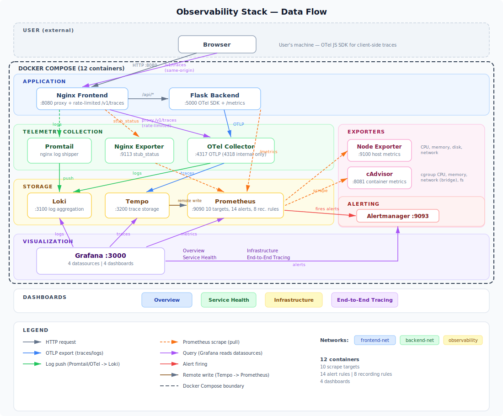

# Docker + CI/CD: OpenTelemetry Observability Lab

A 12-service Docker Compose stack that deploys a 3-tier task manager application with production-grade observability and a Jenkins CI/CD pipeline. One `make up` command brings up the application, telemetry collection, storage, alerting, and pre-built Grafana dashboards.

---

## Architecture

```
                          ┌─────────────────────────────────┐
                          │         APPLICATION             │
                          │                                 │
                          │  ┌───────────┐   ┌───────────┐  │
              :8080       │  │  Nginx    │──▶│  Flask    │  │
            ◀─────────────│  │  Frontend │   │  Backend  │  │
  Browser traces ────────▶│  │ /v1/traces│   │  :5000    │  │
  (same-origin, rate-     │  │(rate-ltd) │   │           │  │
   limited 10r/s)         │  └─┬──┬────┬─┘   └─────┬─────┘  │
                          └────┼──┼────┼───────────┼────────┘
                               │  │    │           │
                     logs      │  │stub│    OTLP   │  /metrics
                     (file)    │  │stat│  (traces  │  (scrape)
                               │  │    │  + logs)  │
         ┌─────────────────────┼──┼────┼───────────┼────────────────────┐
         │  TELEMETRY          │  │    │           │                    │
         │  COLLECTION         ▼  ▼    ▼           ▼                    │
         │             ┌──────────┐ ┌────────┐ ┌──────────────┐         │
         │             │ Promtail │ │ Nginx  │ │     OTel     │         │
         │             │          │ │Exporter│ │   Collector  │◀── Nginx│
         │             │          │ │ :9113  │ │:4317 (intern)│ /v1/trc │
         │             └────┬─────┘ └───┬────┘ └───┬──────┬───┘         │
         └──────────────────┼───────────┼──────────┼──────┼─────────────┘
                            │           │          │      │
                     push   │    scrape │   export │      │ export
                            │           │          │      │
         ┌──────────────────┼───────────┼──────────┼──────┼────────────┐
         │  STORAGE         ▼           │          ▼      ▼            │
         │          ┌────────────┐      │   ┌────────┐ ┌──────┐        │
         │          │    Loki    │      │   │ Tempo  │ │ Loki │        │
         │          │   :3100    │      │   │ :3200  │ │      │        │
         │          └─────┬──────┘      │   └───┬────┘ └──────┘        │
         │                │             │       │                      │
         │                │     ┌───────┼───────┼──────────────┐       │
         │                │     │       │       │              │       │
         │                │     │  Prometheus   │  remote      │       │
         │                │     │  :9090        │  write       │       │
         │                │     │  (recording + alert rules)   │       │
         │                │     │               │              │       │
         │                │     │  also scrapes:│              │       │
         │                │     │  ├ flask-backend             │       │
         │                │     │  ├ otel-collector            │       │
         │                │     │  ├ nginx-exporter◀────────────       │
         │                │     │  ├ node-exporter             │       │
         │                │     │  ├ cadvisor                  │       │
         │                │     │  ├ tempo, loki, grafana      │       │
         │                │     │  └ alertmanager              │       │
         │                │     └───────┬──────────────────────┘       │
         └────────────────┼─────────────┼──────────────────────────────┘
                          │             │
         ┌────────────────┼─────────────┼─────────────────────────────┐
         │  VISUALIZATION │             │                             │
         │                ▼             ▼                             │
         │  ┌────────────────────────────────────────────┐            │
         │  │              Grafana :3000                 │            │
         │  │                                            │            │
         │  │  Datasources: Prometheus, Tempo,           │            │
         │  │               Loki, Alertmanager           │            │
         │  │                                            │            │
         │  │  Dashboards:                               │            │
         │  │   ├ Overview          (system health)      │            │
         │  │   ├ Service Health    (SLIs + edge)        │            │
         │  │   ├ Infrastructure    (host + containers)  │            │
         │  │   └ End-to-End Tracing                     │            │
         │  └────────────────────────────────────────────┘            │
         └────────────────────────────────────────────────────────────┘

         ┌────────────────────────────────────────────────────────────┐
         │  EXPORTERS (scraped by Prometheus)                         │
         │                                                            │
         │  Node Exporter :9100    host CPU, memory, disk, network    │
         │  cAdvisor :8081         container CPU, memory, network     │
         │  Nginx Exporter :9113   connections, requests/sec          │
         └────────────────────────────────────────────────────────────┘

         ┌────────────────────────────────────────────────────────────┐
         │  ALERTING                                                  │
         │                                                            │
         │  Prometheus ──(fires)──▶ Alertmanager :9093                │
         │                          14 rules across 6 groups          │
         │                          severity routing + inhibition     │
         └────────────────────────────────────────────────────────────┘
```



### Networks

| Network | Services | Purpose |
|---|---|---|
| `frontend-net` | frontend, nginx-exporter, grafana | Public-facing tier |
| `backend-net` | frontend, backend, otel-collector | App-to-API communication |
| `observability` | All telemetry + monitoring services | Metrics, traces, logs transport |

---

## Quick Start

```bash
make up           # Build and start all 12 services
make status       # Verify endpoints are reachable
make health       # Run 29-point health check suite
make traffic      # Generate synthetic traffic for dashboards
make dashboards   # Open Grafana in browser
```

### Default Ports

| Service | Port | URL |
|---|---|---|
| Frontend (Nginx) | 8080 | `http://localhost:8080` |
| Backend (Flask) | 5000 | `http://localhost:5000/health` |
| Grafana | 3000 | `http://localhost:3000` |
| Prometheus | 9090 | `http://localhost:9090` |
| Tempo | 3200 | `http://localhost:3200` |
| Loki | 3100 | `http://localhost:3100` |
| Alertmanager | 9093 | `http://localhost:9093` |
| OTel Collector (gRPC) | 4317 | — |
| Node Exporter | 9100 | `http://localhost:9100/metrics` |
| cAdvisor | 8081 | `http://localhost:8081/metrics` |
| Nginx Exporter | 9113 | `http://localhost:9113/metrics` |

All ports and image versions are configurable via `.env`.

---

## Project Structure

```
Docker-CICD/
├── docker-compose.yml              # 12-service stack definition
├── .env                            # Pinned image versions, ports, retention
├── Makefile                        # 15 lifecycle targets (up/down/health/backup/...)
├── Jenkinsfile                     # 7-stage declarative pipeline
│
├── backend/
│   ├── app.py                      # Flask API with OTel SDK instrumentation
│   ├── Dockerfile                  # Python 3.11-slim build
│   └── requirements.txt            # Flask, OTel, prometheus-client
│
├── frontend/
│   ├── index.html                  # Task manager SPA
│   ├── app.js                      # CRUD logic with client-side tracing
│   ├── otel-browser.js             # OTel browser SDK (traces to collector)
│   ├── styles.css                  # Responsive UI
│   └── default.conf                # Nginx reverse proxy + static serving + stub_status + OTLP trace proxy (rate-limited)
│
├── otel-collector/
│   ├── otel-collector-config.yml   # OTLP receiver → Tempo (traces) + Loki (logs)
│   ├── prometheus.yml              # 10 scrape targets with metric relabeling
│   ├── alert-rules.yml             # 14 alert rules (app + infra + SLO + collector)
│   ├── recording-rules.yml         # 8 recording rules (rates, percentiles)
│   ├── alertmanager.yml            # Severity-based routing with inhibition
│   ├── tempo.yml                   # Trace storage + metrics generator
│   ├── loki-config.yml             # Log aggregation with retention limits
│   └── promtail-config.yml         # Nginx access/error log scraping with label extraction
│
├── grafana/
│   ├── provisioning/
│   │   ├── datasources/datasources.yml   # 4 datasources with cross-linking
│   │   └── dashboards/dashboard-provider.yml
│   └── dashboards/
│       ├── overview.json                 # Single-pane-of-glass system health (14 panels)
│       ├── service-health.json           # Backend SLIs + Edge/Nginx (13 panels)
│       ├── infrastructure.json           # Host + Containers + Obs Stack (22 panels)
│       └── end-to-end-tracing.json       # Trace search, service map, correlated logs
│
├── scripts/
│   ├── health-checks.sh            # 29-point validation suite
│   ├── state-contract.sh           # Post-deploy state artifact (JSON + KV)
│   ├── validate-versions.sh        # Running images vs .env drift detection
│   ├── backup.sh                   # Volume snapshots with manifest + retention
│   ├── restore.sh                  # Volume restore from timestamp or latest
│   └── bootstrap_debian13_jenkins_agent.sh  # Deploy target VM provisioning
│
├── jenkins/
│   ├── jenkins-inbound-agent-with-jq-docker-rsync  # Agent Dockerfile
│   ├── jenkins_setup               # Controller + agent launch commands
│   └── jenkins_plugins.md          # Required plugin inventory
│
└── lib/
    ├── log.sh                      # Structured logging (ANSI, timestamps)
    └── checks.sh                   # Reusable health check functions
```

---

## Services

### Application Layer

**Backend** — Flask REST API with full-stack OpenTelemetry instrumentation.
- CRUD endpoints for task management (`/api/tasks`)
- OTel SDK: traces exported to Tempo via OTLP, logs exported to Loki via OTLP
- Prometheus client library: `http_requests_total`, `http_request_duration_seconds`, `http_errors_total`, `db_query_duration_seconds` exposed at `/metrics`
- SQLAlchemy event listeners track per-query latency by operation type (SELECT/INSERT/UPDATE/DELETE)
- Testing endpoints: `/api/simulate-error`, `/api/simulate-slow`, `/api/smoke/db`
- JSON structured logging with trace/span ID correlation

**Frontend** — Nginx serving a single-page task manager with browser-side OTel tracing.
- Nginx reverse proxies `/api/` to the Flask backend using Docker DNS re-resolution
- Nginx reverse proxies `/v1/traces` to the OTel Collector with rate limiting (10 req/s per IP, burst 20) — browser traces are same-origin, no CORS needed
- `stub_status` endpoint exposed for nginx-exporter (restricted to Docker subnets)
- OTel browser SDK sends traces through Nginx (same-origin `/v1/traces`), not directly to the collector
- Dynamic observability links adapt to any hostname (localhost, VM IP, etc.)
- Nginx access/error logs written to a shared volume for Promtail ingestion

### Telemetry Collection

**OTel Collector** — Central telemetry router.
- Receives OTLP via gRPC (4317) and HTTP (4318); HTTP port is internal-only (not exposed to the host)
- Browser traces arrive via Nginx reverse proxy (rate-limited), not directly from the browser
- CORS `allowed_origins` configured via `ALLOWED_ORIGIN` env var in `.env` (no wildcard)
- Pipelines: traces → Tempo, logs → Loki (with `loki.resource.labels` mapping)
- Processors: batch (1024/10s), memory limiter (512 MiB), resource attributes
- No metrics pipeline — Prometheus scrapes the Flask `/metrics` endpoint directly to avoid duplication

**Promtail** — Nginx log shipper.
- Two scrape jobs: `nginx-access` and `nginx-error`, each with a static `log_type` label
- Access log pipeline: parses combined log format, extracts method/status labels, normalizes paths to bounded `path_group` (e.g., `/api/tasks/:id`) to prevent cardinality explosion
- Error log pipeline: extracts timestamp and severity level

### Storage

**Prometheus** — Metrics storage and alerting engine.
- 10 scrape targets: flask-backend, prometheus, otel-collector, tempo, loki, grafana, alertmanager, node-exporter, nginx-exporter, cadvisor
- cAdvisor scrape uses `metric_relabel_configs` to keep only 10 metric families and drop non-Docker cgroups
- `honor_labels: true` on flask-backend, `honor_timestamps: false` on cadvisor
- 15-day retention (configurable via `.env`)
- 8 recording rules pre-compute host CPU/memory/disk utilization and HTTP golden signal rollups
- 14 alert rules evaluate against application health, SLO burn rates, infrastructure thresholds, storage predictions, and collector health
- Remote write receiver enabled for Tempo's metrics generator

**Tempo** — Distributed trace storage.
- Receives traces from OTel Collector via OTLP
- Metrics generator produces span-metrics and service-graphs, remote-writes to Prometheus
- Local filesystem backend with WAL

**Loki** — Log aggregation.
- Receives logs from OTel Collector (application logs) and Promtail (nginx logs)
- 168-hour retention with ingestion rate limits (10 MB/s burst to 20 MB/s)
- Embedded results cache (100 MB)

### Alerting

**Alertmanager** — Alert routing and deduplication.
- Severity-based routing: `critical` alerts get 5s group wait, `warning` gets default
- Inhibition rules: critical alerts suppress matching warnings
- Webhook receivers (configurable for Slack, PagerDuty, email)

**Alert Rules** (14 rules across 6 groups):
| Group | Alert | Condition |
|---|---|---|
| Application | `BackendDown` | `up{job="flask-backend"} == 0` for 1m |
| Application | `HighErrorRate` | >5% 5xx responses over 2m |
| Application | `HighLatencyP95` | P95 > 500ms over 2m |
| SLO | `HighAvailabilityBurnRate` | 14.4x burn rate on 99% SLO (critical) |
| Infrastructure | `HostHighCpuUsage` | CPU > 85% for 5m |
| Infrastructure | `HostHighMemoryUsage` | Memory > 85% for 5m |
| Infrastructure | `HostDiskSpaceWarning` | Disk > 80% for 5m |
| Storage | `PrometheusTSDBHighDiskUsage` | TSDB > 4GB |
| Storage | `HostDiskWillFillIn24h` | predict_linear projects disk full within 24h |
| Stack | `PrometheusTargetDown` | Any scrape target down 2m |
| Stack | `OtelCollectorDroppedSpans` | Span export failures over 5m |
| Collector | `OtelCollectorHighMemory` | RSS > 400MB |
| Collector | `LokiIngestionErrors` | Loki ingestion errors detected |
| Collector | `PrometheusScrapeSlow` | Any scrape taking > 10s |

### Metrics Exporters

**Node Exporter** — Host-level metrics (CPU, memory, disk, network) scraped by Prometheus.

**Nginx Exporter** — Sidecar that scrapes Nginx `stub_status` and exposes connection/request metrics for Prometheus.

**cAdvisor** — Container-level metrics (CPU, memory, network, filesystem) from Docker cgroups. Runs privileged with host `/proc`, `/sys`, and Docker socket access. On Docker Desktop, per-container network metrics are unavailable; network data is collected at the root cgroup level with per-interface breakdown.

### Visualization

**Grafana** — Pre-provisioned with 4 datasources and 4 dashboards.

- **Overview** (14 panels): Single-pane-of-glass. Backend availability gauge, P95 latency, scrape targets up %, host CPU, request rate, error rate, host memory, and observability stack indicators (dropped spans, head series, active alerts, disk usage).
- **Service Health** (13 panels, 2 rows): **Backend SLIs** -- availability gauge, P95 gauge, request rate by endpoint, error rate by endpoint, response time percentiles, DB query P95, status code breakdown. **Edge / Nginx** -- active connections, req/s, connection states, HTTP status codes from logs, top paths from logs, error logs.
- **Infrastructure** (22 panels, 3 rows): **Host** -- CPU, memory, disk gauge, network RX/TX, system load, filesystem available. **Containers** -- cgroup CPU/memory, memory vs limit, network RX/TX (bridge interfaces), Docker total memory. **Observability Stack** -- TSDB head series, scrape duration, rule eval duration, span export/fail rates, collector memory RSS, Loki/Tempo ingestion rates, scrape targets UP/DOWN table.
- **End-to-End Tracing** (3 panels): TraceQL search, service dependency map, correlated application logs.
- Datasource cross-linking: Tempo traces → Loki logs (by trace ID), Tempo traces → Prometheus metrics (request/error rates)

**Dashboard drill-down workflow**: Overview first (is anything broken?) → Service Health for app problems → Infrastructure for resource problems → End-to-End Tracing for request-level debugging.

---

## CI/CD Pipeline

A 7-stage Jenkins declarative pipeline deploys the stack to a remote VM via SSH.

```
┌────────────┐    ┌──────────────────┐    ┌──────────┐    ┌──────┐
│ Sanity on  │───▶│ Ensure remote    │───▶│ Sync repo│───▶│ Lint │
│ agent      │    │ Docker context   │    │ to VM    │    │      │
└────────────┘    └──────────────────┘    └──────────┘    └──┬───┘
                                                             │
┌────────────────┐    ┌────────────────┐    ┌─────────────┐  │
│ Version        │◀───│ State contract │◀───│ Health      │◀─┘
│ validation     │    │                │    │ checks      │
└────────────────┘    └────────────────┘    └─────────────┘
                                      ▲
                      Compose up ─────┘
                      (remote via SSH)
```

**Pipeline stages:**
1. **Sanity on agent** — Verify SSH, Docker CLI, Compose plugin available
2. **Ensure remote Docker context** — Create SSH-based Docker context to target VM
3. **Sync repo to VM** — `rsync -az --delete` the full project to the deploy target
4. **Lint** — ShellCheck all bash scripts
5. **Compose up** — `make up` on the remote VM
6. **Health checks** — Wait for Tempo/Loki readiness (up to 3 min), then `make health`
7. **State contract** — Generate `state.json` + `state.kv` artifacts
8. **Version validation** — Compare running container images against `.env`

**Post-build:**
- On failure: captures last 200 lines of container logs as a Jenkins artifact
- On success: prints the state contract KV output

### Jenkins Agent

Custom Docker image (`jenkins/jenkins-inbound-agent-with-jq-docker-rsync`) extends the official inbound agent with:
- Docker CLI + Compose plugin (for remote Docker context)
- jq, rsync, openssh-client, git

### Deploy Target VM

`scripts/bootstrap_debian13_jenkins_agent.sh` provisions a Debian 13 VM as a deployment target:
- Creates a locked `jenkins` user (SSH key-only, no sudo)
- Configures Docker group access with security mitigations
- Hardens SSH (key-only auth, no root login)
- Enables automatic security updates
- Configures Docker daemon (log rotation, live-restore, no TCP)

---

## Makefile Targets

| Category | Target | Description |
|---|---|---|
| **Deployment** | `make up` | Build and start all 12 services |
| | `make down` | Stop all services (preserve volumes) |
| | `make restart` | Stop then start all services |
| **Operations** | `make status` | Container status + endpoint checks |
| | `make logs` | Tail all service logs |
| | `make traffic` | Generate 40 synthetic requests |
| | `make dashboards` | Open Grafana in default browser |
| **Validation** | `make health` | 29-point health check suite |
| | `make smoke` | Quick 3-endpoint smoke test |
| | `make state` | Generate state contract artifact |
| | `make validate-versions` | Running images vs `.env` drift check |
| **Lifecycle** | `make backup` | Snapshot all Docker volumes |
| | `make restore` | Restore from backup (`SNAP=<timestamp>`) |
| **Development** | `make lint` | ShellCheck all bash scripts |
| | `make clean` | Remove generated artifacts |
| **Cleanup** | `make nuke` | Destroy everything (containers, volumes, images) |

---

## Backup and Restore

**Backup** (`make backup`):
- Stops services for consistent snapshots
- Tars each named Docker volume into `backups/<timestamp>/`
- Writes a `manifest.json` mapping volume names to tarballs
- Restarts services automatically
- Enforces 7-day retention on old backups

**Restore** (`make restore` or `make restore SNAP=<timestamp>`):
- Restores from the latest backup or a specific timestamp
- Parses the manifest to identify volumes
- Clears and restores each volume from its tarball
- Restarts services and suggests running `make health`

---

## Observability Data Flow

```
Browser (OTel JS SDK)                    Flask Backend
    │                                       │
    │ traces (same-origin /v1/traces)       │ traces + logs (OTLP/HTTP)
    ▼                                       ▼
┌──────────────────┐              ┌──────────────────────────┐
│  Nginx           │  proxy_pass  │      OTel Collector      │
│  (rate-limited   │─────────────▶│  traces → batch → Tempo  │
│   10r/s burst 20)│              │  logs   → batch → Loki   │
└──────────────────┘              └──────────────────────────┘

Flask /metrics ──────(scrape)──▶ Prometheus ──(alert)──▶ Alertmanager
Nginx stub_status ──▶ Nginx Exporter ──(scrape)──▶ Prometheus
Nginx logs ──(tail)──▶ Promtail ──(push)──▶ Loki
Node Exporter ──────(scrape)──▶ Prometheus
cAdvisor ───────────(scrape)──▶ Prometheus (with metric_relabel_configs)
Tempo metrics generator ──(remote write)──▶ Prometheus

Grafana reads from: Prometheus, Tempo, Loki, Alertmanager
```

---

## Container Security

Every service in the compose stack applies defense-in-depth:

- **`cap_drop: ALL`** on every container — capabilities added back only where required (Nginx gets `NET_BIND_SERVICE`, `CHOWN`, `SETGID`, `SETUID`, `DAC_OVERRIDE`)
- **`read_only: true`** filesystem where possible, with targeted `tmpfs` mounts for write needs
- **`no-new-privileges: true`** on all containers
- **Resource limits** — CPU and memory caps with reservations on every service
- **`:ro` volume mounts** for all configuration files
- **OTLP endpoint hardening** — OTel Collector HTTP port (4318) is not exposed to the host; browser traces are proxied through Nginx with `limit_req` rate limiting (10 req/s per IP, burst 20). CORS `allowed_origins` is locked to a single origin via `ALLOWED_ORIGIN` env var (no wildcard)
- **Exception**: cAdvisor runs `privileged: true` with host `/proc`, `/sys`, and Docker socket access — required for container metric collection

---

## Configuration

All image versions and ports are centralized in `.env`:

```bash
# Image versions (pinned)
PROMETHEUS_IMAGE=prom/prometheus:v2.48.1
GRAFANA_IMAGE=grafana/grafana:10.2.3
TEMPO_IMAGE=grafana/tempo:2.3.1
LOKI_IMAGE=grafana/loki:2.9.3
OTEL_COLLECTOR_IMAGE=otel/opentelemetry-collector-contrib:0.96.0
NGINX_EXPORTER_IMAGE=nginx/nginx-prometheus-exporter:1.1
CADVISOR_IMAGE=gcr.io/cadvisor/cadvisor:v0.49.1
# ... (see .env for full list)

# CORS / Security
ALLOWED_ORIGIN=http://localhost:8080   # Set to http://<VM_IP>:8080 for remote access

# Retention
PROMETHEUS_RETENTION=15d
TEMPO_RETENTION=72h
LOKI_RETENTION=168h
```

---

## License

MIT
